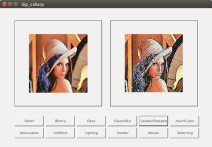
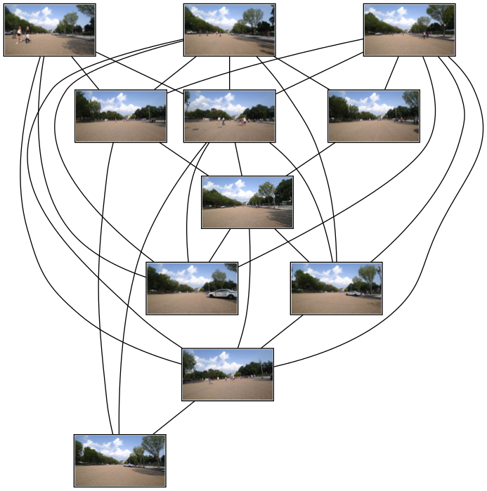

# CCV

Chenguang Computer Vision

---

## Overview

* **core**: core computer vision library with C++ or OpenCV
* **libs**: cv demos with OpenCV, FFTW, PCL, OpenGL, Pangolin
* **apps**: cv demos with the core library or with opencv using C++, Qt, C#, Java

## Build

```bash
# for CMake Plain Project (No ROS)
mkdir build 
cd build
cmake .. [-DBUILD_TEST=ON | -DBUILD_DOCS=ON]
make -j$(nproc)

# for ROS Project, use catkin_tools
catkin build -j$(nproc) -DWITH_ROS=ON [-DWITH_PCL=ON] <package-name>
```

## Core Modules

### Maths

* Basic Math Methods
  - [x] Random Number
  - [ ] Interpolation
    - [ ] Linear Interpolation
    - [ ] Bilinear Interpolation

* Data Structures & Methods
  - [x] Matrix
  - [x] Vector

### Computer Vision

* Data Structure & Methods
  - [x] Size
  - [x] Point2
  - [ ] RGB
* 2D Image & Methods
  - [ ] YImg class
    - [x] Copy
    - [ ] ROI Extraction
    - [ ] Zoom In & Out
    - [ ] Mean Filter
    - [x] Gaussian Filter
    - [x] Image Pyramid
* 2D Features
  - Key Points
    - [x] FAST
    - [ ] ORB
  - Discriptors
  - Line
    - [ ] Edge
    - [ ] Straight Line
* 3D PointCloud
  - [x] Point3
  - [ ] PointCloud
* Camera
  - [ ] Camera Models
* Binocular Stereo Vision
  - [ ] Stereo Match
  - [ ] Disparity Compute
  - [ ] Disparity --> Depth
  - [ ] Depth --> PointCloud

### Kinematics

**Note**: approximate treatment about **small angle**.

* [x] Rotation Matrix
* [x] Quarternion (Hamilton)
* [x] Euler Angle
* [x] Convertor


## Libs

* OpenCV

* FFTW

* PCL

* OpenGL

* Pangolin

## Apps

* [x] Camera Kit

  * [x] Camera App on Android
  
  * [x] Realsense Camera utils
  
  * [x] Camera driver with v4l2

  * [x] Stereo camera driver with MIPI and v4l2

  * [x] Camera utils with ROS

  * [x] Camera calib & rectify utils

* [x] [CVStudio](https://github.com/cggos/CVStudio): GUI App with Qt for Computer Vision :sunny:

  <p align="center">
    
  </p>

* [x] DIP Demo with Java
  

* [x] DIP Demo with C#

  

* [x] Face Detection

* [ ] Medical Imaging

* [x] Stereo Matching with OpenCL

* [x] Stereo Reconstruction with ROS

## Languages

### Python

* View Image Matches with **GraphViz**
  ```sh
  scripts/cv_py/img_match.py
  ```

  <p align="center">
    
  </p>

### Matlab

### Java

### C#
