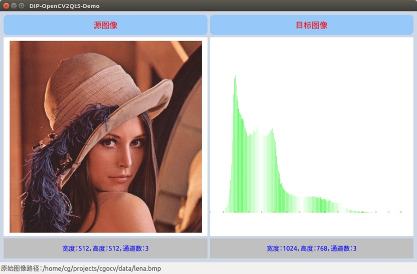
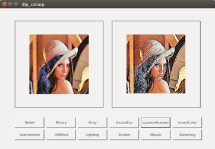

# CVKit

Computer Vision Kit 

<!-- <p align=center>
  
</p> -->

-----

## Overview

* **core**: core computer vision library with C++ or OpenCV
* **libs**: cv demos with OpenCV, FFTW, PCL, OpenGL, Pangolin
* **apps**: cv demos with the core library or with opencv using C++, Qt, C#, Java
* **scripts**: cv demos with Python and Matlab

* build
  
  ```bash
  # for ROS Project
  # use catkin_tools
  catkin build <package-name>
  
  # for CMake Plain Project (No ROS)
  mkdir build & cd build
  cmake .. & make
  ```

## Apps

* [x] DIP Demo with Qt :sunny:

  <p align="center">
    
  </p>

* [x] DIP Demo with Java
  

* [x] DIP Demo with C#

  

* [x] Face Detection

* [ ] Medical Imaging

* [x] Stereo Matching with OpenCL

* [x] Stereo Reconstruction with ROS
