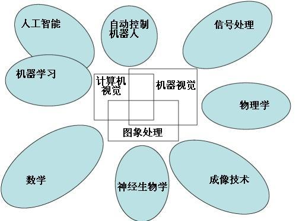

# CVKit

Computer Vision Kit 

<p align=center>
  
</p>

-----

## Overview

* core computer vision library
* apps based on the core library
* computer vision docs
* demos based on opencv and pcl using c++, matlab or c#

## Build

* ROS Project
  ```bash
  # use catkin_tools
  catkin build <package-name>
  ```
* CMake Plain Project (No ROS)
  ```bash
  mkdir build & cd build
  cmake .. & make
  ```

## Apps

* [x] DIP Demo with Qt :sunny:

* [x] DIP Demo with Java

* [x] DIP Demo with C#

* [x] Face Detection

* [ ] Medical Imaging

* [x] Stereo Matching with OpenCL

* [x] Stereo Reconstruction with ROS
