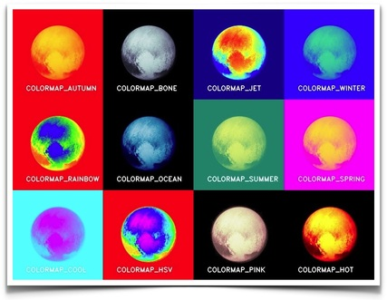

# Algorithm for Image Process

-----

## ColorMap

* [applyColorMap for pseudocoloring in OpenCV ( C++ / Python )](https://www.learnopencv.com/applycolormap-for-pseudocoloring-in-opencv-c-python/)  
  
