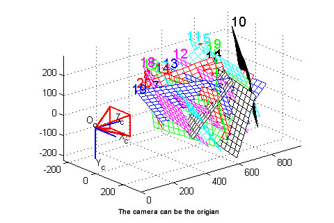
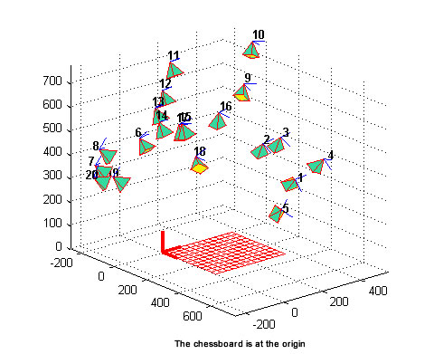
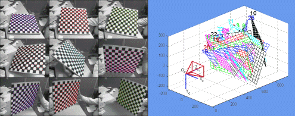

# Camera Calibration & Rectification

   

-----

[TOC]

# Camera Calibration

* [张氏法相机标定](https://zhuanlan.zhihu.com/p/24651968)
* [Multi-Camera Self-Calibration](http://cmp.felk.cvut.cz/~svoboda/SelfCal/)
* [LIBCBDETECT: Corner and Checkerboard Detection](http://www.cvlibs.net/software/libcbdetect/): MATLAB code for fully automatic sub-pixel checkerboard / chessboard pattern detection

## OpenCV
* [Interactive camera calibration application](http://docs.opencv.org/3.2.0/d7/d21/tutorial_interactive_calibration.html)
* [Calibrate fisheye lens using OpenCV](https://medium.com/@kennethjiang/calibrate-fisheye-lens-using-opencv-333b05afa0b0)
* [Omnidirectional Cameara Calibration](https://docs.opencv.org/3.4/dd/d12/tutorial_omnidir_calib_main.html)
* [Custom Calibration Pattern for 3D reconstruction](https://docs.opencv.org/3.3.1/d3/ddc/group__ccalib.html)

## camera_calibration (ROS Wiki)
* http://wiki.ros.org/camera_calibration

Supported camera model: **pinhole camera model**, which is standard in OpenCV and ROS

## Matlab

### Caltech's Camera Calibration Toolbox for Matlab (by Jean-Yves Bouguet)
* http://www.vision.caltech.edu/bouguetj/calib_doc/

  

### Omnidirectional Calibration Toolbox (by Christopher Mei)

* [The toolbox](http://www.robots.ox.ac.uk/~cmei/Toolbox.html) has been successfully used to calibrate hyperbolic, parabolic, folded mirror, spherical and wide-angle sensors.
* It is a combination of the unified projection model from Geyer and Barreto and a radial distortion function. This model makes it possible take into account the distortion introduced by telecentric lenses (for parabolic mirrors) and gives a greater flexibility (spherical mirrors can be calibrated).

### OCamCalib: Omnidirectional Camera Calibration Toolbox for Matlab (by Davide Scaramuzza)

* https://sites.google.com/site/scarabotix/ocamcalib-toolbox
* Omnidirectional Camera Calibration Toolbox for Matlab (for Windows, MacOS & Linux)
* For catadioptric and fisheye cameras up to 195 degrees

#### Improved OcamCalib

* [urbste/ImprovedOcamCalib](https://github.com/urbste/ImprovedOcamCalib): an add-on to the OCamCalib toolbox by Scaramuzza et al.

### Camera Calibration Toolbox for Generic Lenses (by Juho Kannala)

* http://www.ee.oulu.fi/~jkannala/calibration/calibration.html

This is a camera calibration toolbox for Matlab which can be used for calibrating several different kinds of central cameras. A central camera is a camera which has a single effective viewpoint. The toolbox has been successfully used for both conventional and omnidirectional cameras such as fish-eye lens cameras and catadioptric cameras.

### Calibr
* [Camera calibration toolbox for Matlab](http://www.ee.oulu.fi/~jth/calibr/)

### Stereo Camera Calibrator App
* https://www.mathworks.com/help/vision/ug/stereo-camera-calibrator-app.html
  

### SWARD Camera Calibration Toolbox
* http://swardtoolbox.github.io/

Matlab code for Super-Wide-Angle-lens Radial Distortion correction just using a single image of a checkerboard

### InerVis Toolbox for Matlab -- IMU CAM calibration
* http://home.deec.uc.pt/~jlobo/InerVis_WebIndex/InerVis_Toolbox.html

  

## CamOdoCal

* https://github.com/hengli/camodocal

**Automatic Intrinsic and Extrinsic Calibration of a Rig with Multiple Generic Cameras and Odometry.**  

This C++ library supports the following tasks:  
* Intrinsic calibration of a generic camera.  
* Extrinsic self-calibration of a multi-camera rig for which odometry data is provided.  
* Extrinsic infrastructure-based calibration of a multi-camera rig for which a map generated from task  2 is provided.

The intrinsic calibration process computes the parameters for one of the following three camera models:  

* **Pinhole camera model**
* **Unified projection model** (C. Mei, and P. Rives, Single View Point Omnidirectional Camera Calibration from Planar Grids, ICRA 2007)
* **Equidistant fish-eye model** (J. Kannala, and S. Brandt, A Generic Camera Model and Calibration Method for Conventional, Wide-Angle, and Fish-Eye Lenses, PAMI 2006)

By default, the **unified projection model** is used since this model approximates a wide range of cameras from normal cameras to catadioptric cameras. Note that in our **equidistant fish-eye model**, we use 8 parameters: k2, k3, k4, k5, mu, mv, u0, v0. k1 is set to 1.

## GML C++ Camera Calibration Toolbox
[GML Camera Calibration toolbox](http://graphics.cs.msu.ru/en/node/909) is a free functionally completed tool for cameras' calibrating. You can easy calculate intrinsic and extrinsic camera parameters after calibrating.

## EasyCal Toolbox

* The [EasyCal Toolbox](http://www.cis.upenn.edu/~kostas/tele-immersion/research/downloads/EasyCal/) can be used to calibrate a large cluster of cameras easily eliminating the need to click tediously on multiple images.

## Camera and Range Sensor Calibration Toolbox
* http://www.cvlibs.net/software/calibration/

## velo2cam_calibration

The [velo2cam_calibration](https://github.com/beltransen/velo2cam_calibration) software implements an Automatic Calibration algorithm for Lidar-Stereo camera setups

## Kalibr
[Kalibr](https://github.com/ethz-asl/kalibr) is a toolbox that solves the following calibration problems:  

* Multiple camera calibration
* Camera-IMU calibration
* Rolling Shutter Camera calibration

# Image Rectification

* [image_proc (ROS wiki)](http://wiki.ros.org/image_proc)
  - Single image rectification and color processing.

* [ethz-asl/image_undistort](https://github.com/ethz-asl/image_undistort)
  - A compact package for undistorting images directly from **kalibr calibration files**, Can also perform dense stereo estimation
