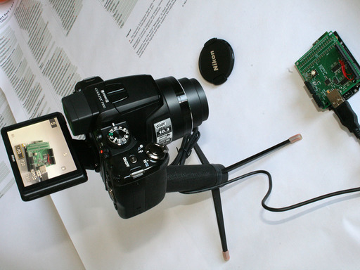
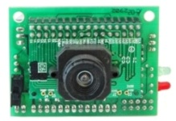
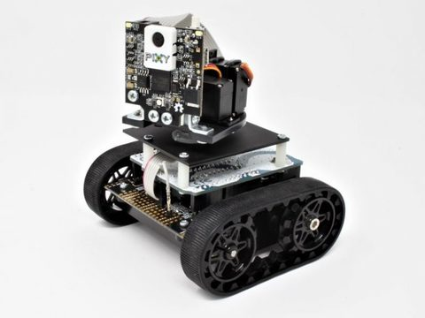
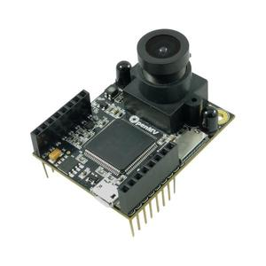
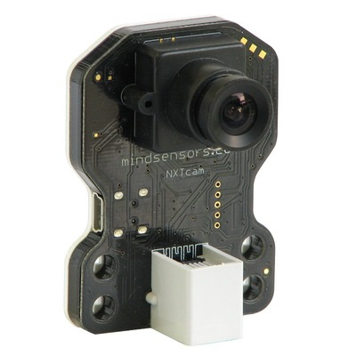
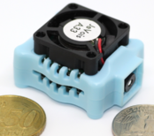

# Cameras

* [Sensors/Cameras (ROS Wiki)](http://wiki.ros.org/Sensors/Cameras)

-----

[TOC]

## 1. Camera Lenses

* [Lensation](https://www.lensation.de/) provides free of charge consulting about lenses, illumination and optical components
* [dxomark](https://www.dxomark.com/): source for image quality benchmarks for phones and cameras

## Knowledge

* [摄像机镜头详细知识](https://zhuanlan.zhihu.com/p/29098395)

### Fisheye Lens
* Its not unusual for a fisheye lens to have a FOV of 185 degrees.

## 2. Industrial Camera

* [iDS](https://en.ids-imaging.com/home.html)
* [1stVision](https://www.1stvision.com/)
* [MatrixVision](https://www.matrix-vision.com)

## 3. Digital Camera
* [gPhoto](http://www.gphoto.org/) is a free, redistributable, ready to use set of digital camera software applications for Unix-like systems
* [digiCamControl](http://digicamcontrol.com/): An innovative and easy to use solution for complex camera control!
* [DSLR Controller](http://www.dslrcontroller.com/) was the first and is still the best app to fully control your Canon EOS DSLR from your Android device, with nothing more than a USB cable.
* [Generic PTP control of digital cameras](https://www.circuitsathome.com/camera-control/generic-ptp-control-of-digital-cameras/)  

## 4. Camera Modules

* [In Search of a Better Serial Camera Module](http://sigalrm.blogspot.com/2013/07/in-search-of-better-serial-camera-module.html)

### [CMUcam](http://www.cmucam.org/)
**Open Source Programmable Embedded Color Vision Sensors**, The first CMUcam made its splash in 1999 as a CREATE Lab project.

* [The CMUcam1 Vision Sensor](https://www.cs.cmu.edu/~cmucam/qanda.html)  

#### [Pixy](https://pixycam.com/)

**Pixy** is **the fifth version of the CMUcam, or CMUcam5**, but “Pixy” is easier to say than CMUcam5, so the name more or less stuck.  Pixy got its start in 2013 as part of a successful Kickstarter campaign, and as a partnership between **Charmed Labs** and **CMU**.

**Pixy2** was announced recently as Pixy’s smaller, faster, and smarter younger sibling.  

### [OpenMV](https://openmv.io/)
The OpenMV(**Open-Source Machine Vision**) project aims at making machine vision more accessible to beginners by developing a user-friendly, open-source, low-cost **machine vision platform**.  

OpenMV cameras are programmable in **Python3** and come with an extensive set of **image processing functions** such as face detection, keypoints descriptors, color tracking, QR and Bar codes decoding, AprilTags, GIF and MJPEG recording and more.  

### [NXTCam-v4](http://www.mindsensors.com/ev3-and-nxt/14-vision-subsystem-camera-for-nxt-or-ev3-nxtcam-v4)
Vision Subsystem - Camera for NXT or EV3 (NXTCam-v4)  

### [JeVois Smart Machine Vision Camera](http://jevois.org/)

Open-source quad-core camera effortlessly adds powerful machine vision to all your PC, Arduino, and Raspberry Pi projects.

## 5. 3D (Depth) Cameras

### Structure Light Camera

#### Kinect
* [Kinect for windows微软中国体感官方网站](http://www.k4w.cn/)
* [OpenKinect](https://openkinect.org/wiki/Main_Page) is an open community of people interested in making use of the amazing Xbox Kinect hardware with our PCs and other devices.
* [Kinect V1 and Kinect V2 fields of view compared](http://smeenk.com/kinect-field-of-view-comparison/)
* [Ubuntu + Kinect + OpenNI + PrimeSense](http://mitchtech.net/ubuntu-kinect-openni-primesense/)
* [【翻译】Kinect v1和Kinect v2的彻底比较](http://www.cnblogs.com/TracePlus/p/4136297.html)
* [code-iai/iai_kinect2](https://github.com/code-iai/iai_kinect2): Tools for using the Kinect One (Kinect v2) in ROS

#### Orbbec Astra Camera
* [astra_camera (ROS Wiki)](http://wiki.ros.org/astra_camera)
* [ROS wrapper for Astra camera](https://github.com/orbbec/ros_astra_camera)

#### ASUS Xtion 2
* https://www.asus.com/3D-Sensor/

### Stereo Camera

#### Realsense Camera
* [realsense_camera (ROS Wiki)](http://wiki.ros.org/realsense_camera)
* [Intel® RealSense­™ Camera ZR300](https://software.intel.com/en-us/realsense/zr300)

#### ZED Stereo Camera
* [StereoLabs](https://www.stereolabs.com/)

#### FLIR Bumblebee
* [立体视觉](https://www.ptgrey.com/stereo-vision-cameras-systems)

#### Tara
* [Tara - USB 3.0 Stereo Vision Camera](https://www.e-consystems.com/3D-USB-stereo-camera.asp)

### Event Camera
* [Event Camera动态视觉传感器，让无人机用相机低成本进行导航](https://www.leiphone.com/news/201709/LkfPqS60ZYgmXk8x.html)
