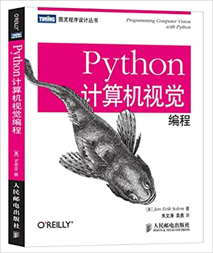

# libccv for Python

[](https://pypi.org/project/libccv/)
[](https://pypi.org/project/libccv/)

Python implementation and wrappers for the Chenguang Computer Vision (CCV) library. This package provides a wide range of computer vision tools, from classical algorithms to modern deep learning models.

<p align="center">
    
</p>

---

## Features

- **Classical CV:** Keypoint detection, Hough transforms, image statistics, and filtering.
- **Deep Learning:** Modules for image classification, object detection (YOLO), semantic segmentation, and deep features.
- **Utilities:** Image matching visualization with Graphviz, fisheye masking, and brightness adjustment.
- **Integration:** Supports PIL, OpenCV, PyLab, and FastAPI for web-based camera access.

## Installation

### From PyPI
```bash
pip install libccv
```

### From Source
```bash
cd python
pip install .
```

### Optional Dependencies
For deep learning features, you can install extra dependencies:
```bash
pip install "libccv[torch]"  # PyTorch support
pip install "libccv[yolo]"   # YOLO/Ultralytics support
pip install "libccv[mp]"     # MediaPipe support
```

---

## Quick Start

### Image Matching Graph
Visualize image matches using Graphviz:
```bash
python -m libccv.img_match_graph
```

### Web Camera with FastAPI
Run a simple web-based camera stream:
```bash
python -m libccv.web_cam_fastapi.app
```

---

## Directory Structure

- `libccv/`: Core Python modules.
  - `keypoint_detection/`: Classical keypoint algorithms.
  - `object_detection/` & `yolo/`: Detection frameworks.
  - `image_classification/`: Classification models.
  - `web_cam_fastapi/`: FastAPI integration for live streams.
- `tests/`: Unit tests for python modules.
- `imgs/`: Documentation assets.

---

## References & Resources

- [Programming Computer Vision with Python](http://programmingcomputervision.com/)
- [OpenCV-Python Tutorials](https://opencv-python-tutroals.readthedocs.io/)
- [Scikit-Image Documentation](https://scikit-image.org/)
- [PyImageSearch](https://www.pyimagesearch.com/)
