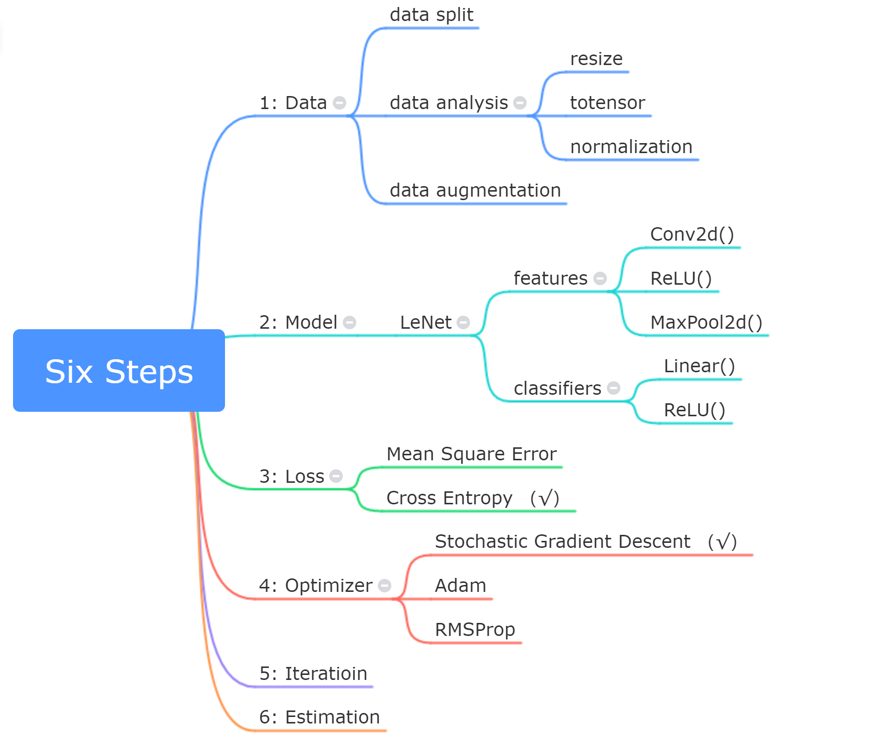

# Classification Model of RMB

Based on 100 pieces of 1￥ and 100 pieces of 100￥, a classification model is built to achieve binary classification task. A couple of real life data have been tested with a good accuracy.

---

## Six steps for machine learning projects

- Step 1: Data (include data split, data analysis, data augmentation, data load)
- Step 2: Model (leNet is used in this project, check out `Model folder`)

    

- Step 3: Loss function (cross entropy is used in this project)
- Step 4: Optimizer (Stochastic Gradient Descent is used in this project)
- Step 5: Iteratively training
- Step 6: Model Estimation

    

