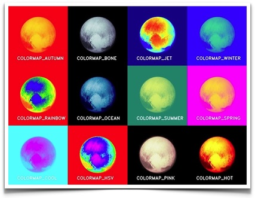

# Stereo Reconstruct

ROS Wrapper for Stereo Reconstruction, generate Depth Image and Point Cloud by left and right images

* [双目立体视觉三维重建 (CSDN)](https://blog.csdn.net/u011178262/article/details/81156412)

-----

## PreRequisites

* [cgocv](https://github.com/chenguang055/cgocv): ChenGuang Open Computer Vision class library
  - Note that change `option(WITH_ROS "Build with ROS" OFF)` to `ON`

## Build
```
catkin_make
```

## Implementation
* [applyColorMap for pseudocoloring in OpenCV ( C++ / Python )](https://www.learnopencv.com/applycolormap-for-pseudocoloring-in-opencv-c-python/)  

