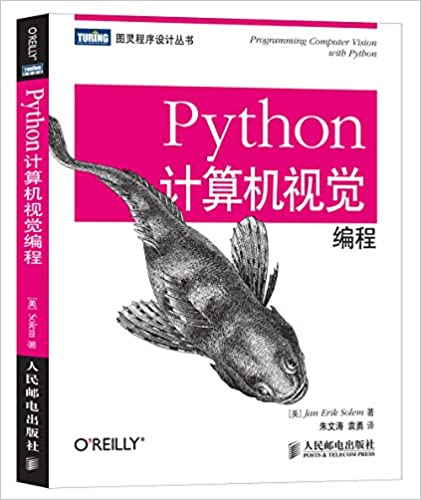

# PyCV

based on [***Programming Computer Vision with Python***](http://programmingcomputervision.com/)

    

---

## Python Imageing Libraries

* [PIL (Python Imaging Library)](http://effbot.org/zone/pil-index.htm) adds image processing capabilities to your Python interpreter
* [scikit-image](https://scikit-image.org/) is a collection of algorithms for image processing

## Relates

* [OpenCV-Python Tutorials](http://opencv-python-tutroals.readthedocs.io/en/latest/py_tutorials/py_tutorials.html)
* [PyImageSearch](https://www.pyimagesearch.com/)
* [Color Palettes for Python](https://github.com/jiffyclub/palettable)

